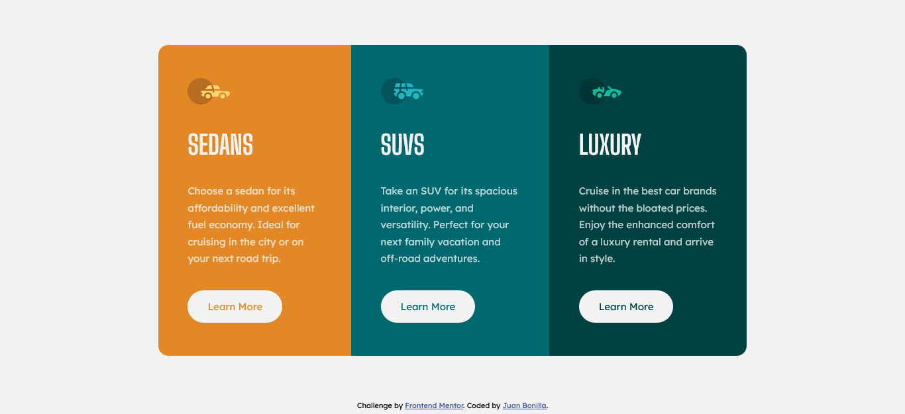

# Frontend Mentor - 3-column preview card component solution

This is a solution to the [3-column preview card component challenge on Frontend Mentor](https://www.frontendmentor.io/challenges/3column-preview-card-component-pH92eAR2-). Frontend Mentor challenges help you improve your coding skills by building realistic projects! 

## Table of contents

- [Overview](#overview)
  - [The challenge](#the-challenge)
  - [Screenshot](#screenshot)
  - [Links](#links)
- [My process](#my-process)
  - [Built with](#built-with)
  - [What I learned](#what-i-learned)
  - [Continued development](#continued-development)
  - [Useful resources](#useful-resources)
- [Author](#author)

## Overview

### The challenge

Users should be able to:

- View the optimal layout depending on their device's screen size
- See hover states for interactive elements

### Screenshot

### Links

- Solution URL: [Click here](https://www.frontendmentor.io/solutions/html-css-sass-bem-flexbox-lGoX_SLiM)
- Live Site URL: [See live site here](https://juanbonilla.me/FEM_3-column-card-component/)

## My process

### Built with

- Semantic HTML5 markup
- CSS / SASS custom properties
- Flexbox
- Mobile-first workflow
- BEM Methodology

### What I learned

I learned how to work with BEM and be able to improve my speed when writing CSS usign SASS!

### Continued development

I found useful to continue working with BEM and SASS. Even though, I want to use it on an entire website just to know how effective could be and then decide if I want to include this on my next projects.

### Useful resources

- [BEM & SASS](https://medium.com/laboratoria-how-to/creando-proyectos-css-mantenibles-con-sass-y-bem-54e013c7b1d9) - This helped me identify the possibility of reduce time when structuring and include styles to my websites.

## Author

- Website - [juanbonilla.me](https://juanbonilla.me)
- Frontend Mentor - [@juanpb96](https://www.frontendmentor.io/profile/juanpb96)
- LinkedIn - [Juan Bonilla](https://www.linkedin.com/in/juan-pablo-bonilla-6b8730115/)

